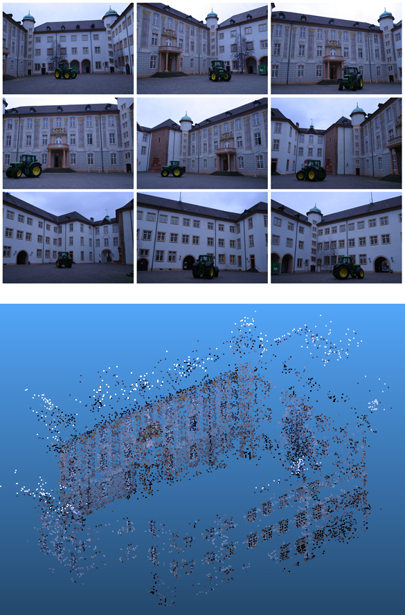

## Introduction

This is a demo project on Structure from Motion (SFM), including pose estimation, 3D points reconstruction. Particullarly, there 
are two version of this project: one is for image sequence as input; and the other is for video file as input. Anyway, both of them
requires the camera capturing with a fixed interial parameters, which should be provided along with images/vido as to the program.

Notice: This program is free for personal, non-profit and academic use.
All right reserved to CVRS: http://cvrs.whu.edu.cn/

If you have any question, please contact: menghanxyz@gmail.com (Menghan Xia)

Here is an example for demonstration below (image topological graph and alignment result): 

